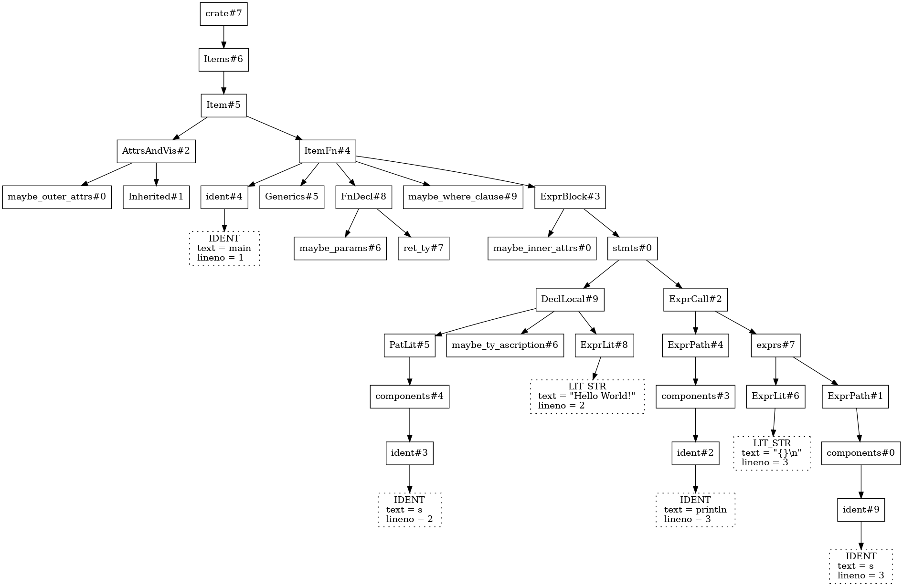
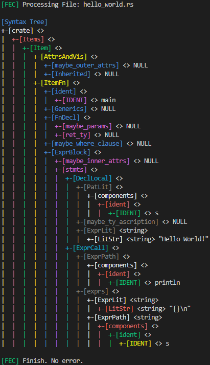
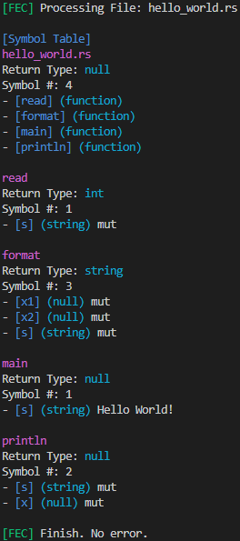
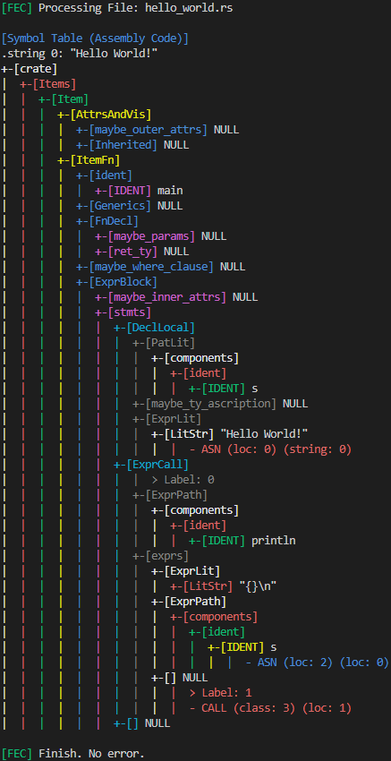

# FeC  
A transpiler that translates Rust code into C code. It supports a small subset of Rust. The name "FeC" stands for "Fe Compiler," with "Fe" being a reference to the Rust programming language.

  

## Supported Features  
### Data Types  
- `boolean`
- `int`  
- `double`  
- `string`  

### Structures  
- Functions  
- Arrays  

### Built-in Functions  
- `read!(var)`: Returns a string representation of `var`.  
- `format!(string, var1, var2)`: Returns a formatted string with `var1` and `var2`.  
- `println!(string, var)`: Prints `string` and `var` to the terminal.  

### Operations  
- **Arithmetic**: `*`, `+`, `/`, `-`  
- **Logical**: `&&`, `||`, `!`  
- **Relational**: `<`, `<=`, `>`, `>=`, `==`  

### Control Statements  
- `while`  
- `for`  
- `if-else`  

## Notes  
- Boolean data types are treated as integers (`int`).  
- Macros (e.g., `read!`, `format!`, `println!`) are treated as functions.  
- There is no local scope; all variables are global.  
- Operator precedence is not enforced; operations are evaluated in the order they appear.  
- A maximum of 100 statements per block is allowed.  

## Main Files  
- `token`: Defines the structure and types of tokens used in lexical analysis.  
- `rustlex` (Lexical Analyzer): Converts source code into tokens using regex patterns. Adapted from [bleibig's lexer.l](https://github.com/bleibig/rust-grammar/blob/master/lexer.l).  
- `rustgram` (Syntax Analyzer): Constructs a parse tree from the token stream. Adapted from [bleibig's parser-lalr.y](https://github.com/bleibig/rust-grammar/blob/master/parser-lalr.y).  
- `symtab` (Semantic Analysis): Manages symbol tables for semantic analysis and type checking.  
- `tac` (Code Generator): Generates the C code from the intermediate representation. Variables are stored in a union named `data`, which can hold `int`, `float`, and `char[64]` types.  

## Usage  
### Requirements  
- Flex  
- Bison  

Install dependencies (on Ubuntu/Debian):  
```sh  
sudo apt-get install flex bison  
```  

Compile FeC:  
```sh  
make  
```  

Run FeC:  
```sh  
./fec [-dot] [-tree] [-symtab] [-asm] [-comp] <input_file>  
```  

If no errors are found, the program outputs a translated C file named `<input_file>.c`.  

---

### Command-Line Options  
#### **-dot**: Generate a DOT file of the parse tree  
Creates a DOT file named `<input_file>.dot`. Use the `graphviz` package to convert it into an image:  
```sh  
dot -Tpng <input_file>.dot -o dot.png  
```  

Example dot graph:  
  
The solid boxes represent nodes, and the dotted boxes represent data literals.

---

#### **-tree**: Display the token tree  
Prints a hierarchical visualization of how the code is parsed according to the language's grammar.  

Each node follows the format:  
```  
+-[Symbol] <Data_type> Data_literal
```  
- **Symbol**: The token type
- **Data_type**: The data type of the literal (if applicable).
- **Data_literal**: The raw value of the data literal (if applicable).

Example token tree:  
  
- `Item` is a child of `Items`, which itself is a child of `Create`.  
- `AttrsAndVis` has two children: `maybe_outer_attrs` and `Inherited`.  

---

#### **-symtab**: Display the symbol table  
Outputs an overview of the symbols (variables, functions, constants, etc.) in the program and functions.  

Each section includes:  
- **Return type**  
- **Number of symbols**  
- **List of symbols**, each with:  
  - **Name**  
  - **Type**  
  - **Mutability** (if applicable)  

Example symbol table:  
  

---

#### **-asm**: Display the symbol tree along with the assembly code  
Provides a symbolic representation of the program along with generated assembly code.  

**Label Format:**  
```  
> Label: [Number]  
```  
A label marks a specific jump location in the generated code.  

**Instruction Format:**  
```  
- Type (dst) (src)  
```  
- **Type**: The operation type.  
- **dst**: The destination of the result.  
- **src**: The source value.  

**Operand Format:**  
```  
(region, offset)  
```  
- **Operand**: A memory location.  
- **region**: The storage area (e.g., `loc`, `string`, or `const`).  
- **offset**: The index or position within that region.  

Example Symbol Table:  
  

---

#### **-comp**: Compile the translated C file  
Creates an executable by compiling the translated C file into an object file and linking it. If successful, the executable will have the same name as the input file.

## Credits  
- [Rust Icon](https://rustacean.net): Image of Ferris the crab.
- [bleibig's Lexer and Parser](https://github.com/bleibig/rust-grammar/blob/master): Adapted from bleibig's Lexer and Parser for Rust grammar.